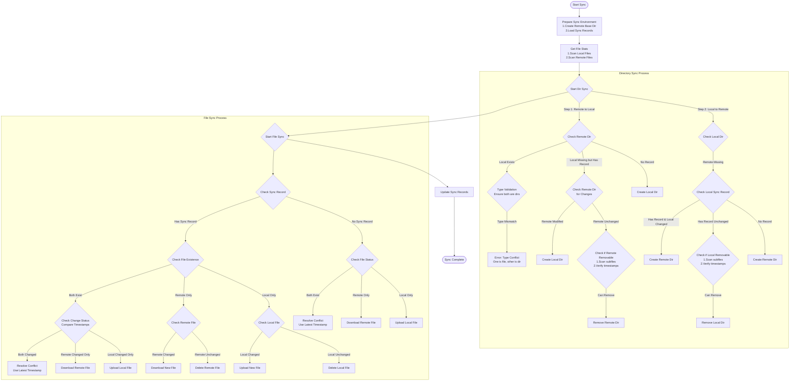

# 🔄 Nutstore Sync

This plugin enables two-way synchronization between Obsidian notes and Nutstore via WebDAV protocol.

## ✨ Key Features

- **Two-way Sync**: Efficiently synchronize your notes across devices
- **Incremental Sync**: Fast updates that only transfer changed files, making large vaults sync quickly
- **Single Sign-On**: Connect to Nutstore with simple authorization instead of manually entering WebDAV credentials
- **WebDAV Explorer**: Visual file browser for remote file management
- **Smart Conflict Resolution**:
  - Character-level comparison to automatically merge changes when possible
  - Option to use timestamp-based resolution (newest file wins)
- **Loose Sync Mode**: Optimize performance for vaults with thousands of notes
- **Large File Handling**: Set size limits to skip large files for better performance
- **Sync Status Tracking**: Clear visual indicators of sync progress and completion
- **Detailed Logging**: Comprehensive logs for troubleshooting

## ⚠️ Important Notes

- ⏳ Initial sync may take longer (especially with many files)
- 💾 Please backup before syncing

## 🔍 Sync Algorithm

