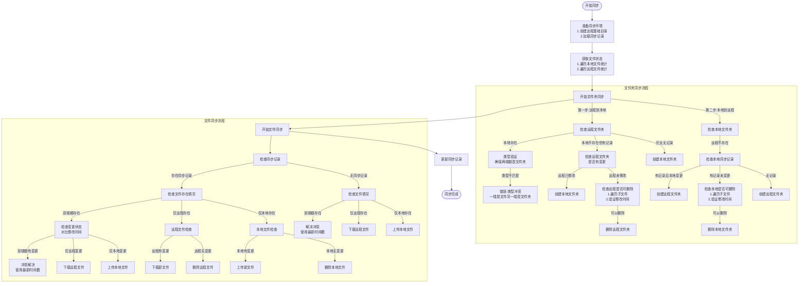

# 🔄 Nutstore Sync

此插件允许您通过 WebDAV 协议将 Obsidian 笔记与坚果云进行双向同步。

## ✨ 主要特性

- **双向同步**: 高效地在多设备间同步笔记
- **增量同步**: 只传输更改过的文件，使大型笔记库也能快速同步
- **单点登录**: 通过简单授权连接坚果云，无需手动输入 WebDAV 凭据
- **WebDAV 文件浏览器**: 远程文件管理的可视化界面
- **智能冲突解决**:
  - 字符级比较自动合并可能的更改
  - 支持基于时间戳的解决方案（最新文件优先）
- **宽松同步模式**: 优化对包含数千笔记的仓库的性能
- **大文件处理**: 设置大小限制以跳过大文件，提升性能
- **同步状态跟踪**: 清晰的同步进度和完成提示
- **详细日志**: 全面的故障排查日志

## ⚠️ 注意事项

- ⏳ 首次同步可能需要较长时间 (文件比较多时)
- 💾 请在同步之前备份

## 🔍 同步算法

